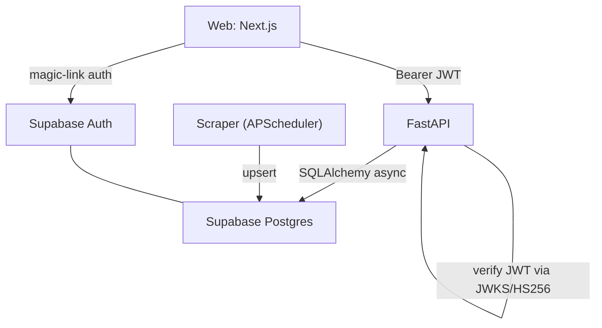

# NewsWithFriends

A social news discovery service: Follow the sources you trust, get a single aggregated feed, star what matters, and see what your friends are reading and saying.

Built on a **FastAPI** API + **Python scraper worker** backed by
**Supabase** (Postgres + Auth), with a **Next.js** frontend. Deployed on
**Railway** at [newswithfriends.org](https://newswithfriends.org).



## Repo layout

```
newswithfriends/
  supabase/
    migrations/*.sql   # schema + RLS (source of truth)
    seed.sql           # dev sources
    config.toml
  backend/             # one Python project, two entrypoints
    core/              # config, db (SQLAlchemy async), models, auth, logging
    api/               # FastAPI app (nwf-api)
    scraper/           # APScheduler worker (nwf-scraper)
    tests/
  web/                 # Next.js App Router frontend
  .github/workflows/   # CI
```

## Prerequisites

- Python 3.12+ and `[uv](https://docs.astral.sh/uv/)`
- Node 22+
- [Supabase CLI](https://supabase.com/docs/guides/cli) (for local dev) or a
  hosted Supabase project

## 1. Database + Auth (Supabase)

Local:

```bash
supabase start          # boots Postgres + Auth + Studio
supabase db reset       # applies migrations/ + seed.sql
```

Hosted: create a project, then push migrations:

```bash
supabase link --project-ref <ref>
supabase db push
```

Magic-link (OTP) auth is enabled in `supabase/config.toml`.

## 2. Backend (API + scraper)

```bash
cd backend
uv venv && source .venv/bin/activate
uv pip install -e ".[dev]"
cp .env.example .env     # fill DATABASE_URL + SUPABASE_* values

# API (http://localhost:8000, docs at /docs)
nwf-api

# Scraper worker (separate terminal)
nwf-scraper
```

`SUPABASE_JWT_SECRET` (HS256) is convenient for local dev — the Supabase CLI
prints it on `supabase start`. In production leave it blank to verify tokens
against the project JWKS (asymmetric).

Checks:

```bash
ruff check .
mypy core api scraper
pytest -q
```

## 3. Web

```bash
cd web
npm install
cp .env.example .env.local   # fill NEXT_PUBLIC_SUPABASE_* + NEXT_PUBLIC_API_URL
npm run dev                  # http://localhost:3000
```

The web app uses `supabase-js` for the auth session only; all data flows through
the FastAPI API with the session JWT as a bearer token.

### Typed API client

Types live in `web/lib/types.ts`. To regenerate a full client from the live
OpenAPI schema:

```bash
npx openapi-typescript http://localhost:8000/openapi.json -o lib/api-schema.ts
# or: npm run gen:api
```

## Deployment (Railway + Supabase)

Everything ships on **Railway** under the `newswithfriends.org` domains, backed
by a managed **Supabase** project.

| Component        | Railway service    | Domain                                           |
| ---------------- | ------------------ | ------------------------------------------------ |
| Web (Next.js)    | `nwf-web`          | `newswithfriends.org`, `www.newswithfriends.org` |
| API (FastAPI)    | `nwf-api`          | `api.newswithfriends.org`                        |
| Scraper (worker) | `nwf-scraper`      | — (no public domain)                             |
| Postgres + Auth  | Supabase (managed) | —                                                |

### Supabase

Managed Postgres + Auth; the SQL migrations are the schema source of truth.
In the Supabase dashboard set **Auth → URL Configuration**:

- Site URL: `https://newswithfriends.org`
- Redirect URLs: `https://newswithfriends.org/feed`, `https://www.newswithfriends.org/feed`

### Railway services

Create one Railway project with three services from this repo. The two Python
services share `backend/Dockerfile` + `backend/railway.json` (which defaults the
start command to `nwf-api`); the scraper service overrides its start command to
`nwf-scraper` in the Railway dashboard. The web service uses `web/railway.json`.

- `nwf-api` — root `backend`, start `nwf-api`. Attach domain
  `api.newswithfriends.org`. Env:
  - `DATABASE_URL` (Supabase pooled async URL, `postgresql+asyncpg://…`)
  - `SUPABASE_URL=https://<ref>.supabase.co`
  - `CORS_ORIGINS=["https://newswithfriends.org","https://www.newswithfriends.org"]`
  - leave `SUPABASE_JWT_SECRET` **empty** in prod (verify via JWKS)
  - `ADMIN_API_SECRET` (random), `LOG_JSON=true`
- `nwf-scraper` — root `backend`, start `nwf-scraper`. Env: `DATABASE_URL`,
  `SUPABASE_URL`, `SCRAPE_INTERVAL_SECONDS`, `SCRAPE_BATCH_SIZE`, `LOG_JSON=true`.
- `nwf-web` — root `web` (Nixpacks/`npm run build` → `npm run start`).
  Attach `newswithfriends.org` + `www`. Env:
  - `NEXT_PUBLIC_SUPABASE_URL=https://<ref>.supabase.co`
  - `NEXT_PUBLIC_SUPABASE_ANON_KEY=<anon key>`
  - `NEXT_PUBLIC_API_URL=https://api.newswithfriends.org`

A `render.yaml` is also included as an alternative host for the two Python  
processes.
