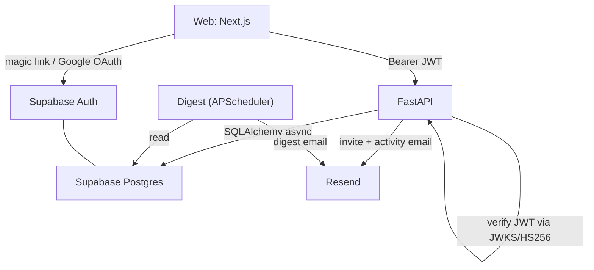

# NewsWithFriends

A private place to read and talk about the news with people you actually
know. Members share article links with a take; conversations are private,
visible to the participants and to their friends, and never public. Two
surfaces: **Discover** (the most active stories platform-wide) and
**Conversations** (what your friends and their friends are saying).

Also: symmetric friend requests behind an invite cap, threaded comments with
@mentions, seven reactions, read tracking ("who read this", "reading now"),
a daily digest email and instant activity emails.

Built on a **FastAPI** API backed by **Supabase** (Postgres + Auth), with a **Next.js** frontend and a daily digest worker. Deployed on **Railway** at [newswithfriends.org](https://newswithfriends.org).



```mermaid
flowchart TD
  Web["Web: Next.js"] -->|magic link / Google OAuth| SBAuth["Supabase Auth"]
  Web -->|Bearer JWT| API["FastAPI"]
  API -->|verify JWT via JWKS/HS256| API
  API -->|SQLAlchemy async| DB["Supabase Postgres"]
  API -->|invite + activity email| Resend["Resend"]
  Digest["Digest (APScheduler)"] -->|read| DB
  Digest -->|digest email| Resend
  SBAuth --- DB
```


## Repo layout

```
newswithfriends/
  supabase/
    migrations/*.sql   # schema + RLS (source of truth)
    seed.sql           # notes on loading the outlet catalog
    config.toml
  backend/             # one Python project, two entrypoints
    core/              # config, db (SQLAlchemy async), models, auth, logging
    api/               # FastAPI app (nwf-api)
    digest/            # Daily activity digest emails (nwf-digest)
    scripts/           # one-off dev/admin utilities (not in the image)
    tests/
  web/                 # Next.js App Router frontend
  data/sources.json    # publisher catalog (names + logos for attribution)
  design/              # product strategy notes
  .github/workflows/   # CI
```


## Prerequisites

- Python 3.12+ and [uv](https://docs.astral.sh/uv/)
- Node 22+
- [Supabase CLI](https://supabase.com/docs/guides/cli) (for local dev) or a
hosted Supabase project


## 1. Database + Auth (Supabase)

Local:

```bash
supabase start          # boots Postgres + Auth + Studio
supabase db reset       # applies migrations/ + seed.sql
```

Hosted: create a project, then push migrations:

```bash
supabase link --project-ref <ref>
supabase db push
```

Magic-link (OTP) and Google OAuth are both enabled in
`supabase/config.toml`; Google needs `SUPABASE_AUTH_GOOGLE_CLIENT_ID` and
`SUPABASE_AUTH_GOOGLE_SECRET` in the environment.

No Docker or Supabase CLI? `backend/scripts/apply_migrations.py` applies
`supabase/migrations/*.sql` straight to whatever `DATABASE_URL` names — dev
only; production schema changes go through the Supabase tooling above.

## 2. Backend (API + digest)

```bash
cd backend
uv venv && source .venv/bin/activate
uv pip install -e ".[dev]"
cp .env.example .env     # fill DATABASE_URL + SUPABASE_* values

# API (http://localhost:8000, docs at /docs)
nwf-api

# Daily digest worker (separate terminal; cron at DIGEST_SEND_HOUR_PT PT)
nwf-digest
```

`SUPABASE_JWT_SECRET` (HS256) is convenient for local dev — the Supabase CLI
prints it on `supabase start`. In production leave it blank to verify tokens
against the project JWKS (asymmetric).

Checks:

```bash
ruff check .
mypy core api digest
pytest -q
```


## 3. Web

```bash
cd web
npm install
cp .env.example .env.local   # fill NEXT_PUBLIC_SUPABASE_* + NEXT_PUBLIC_API_URL
npm run dev                  # http://localhost:3000
```

The web app uses `supabase-js` for the auth session only; all data flows through
the FastAPI API with the session JWT as a bearer token.

### Typed API client

Types live in `web/lib/types.ts`. To regenerate a full client from the live
OpenAPI schema:

```bash
npx openapi-typescript http://localhost:8000/openapi.json -o lib/api-schema.ts
# or: npm run gen:api
```


## Deployment (Railway + Supabase)

Everything ships on **Railway** under the `newswithfriends.org` domains, backed
by a managed **Supabase** project.


| Component       | Railway service    | Domain                                           |
| --------------- | ------------------ | ------------------------------------------------ |
| Web (Next.js)   | `nwf-web`          | `newswithfriends.org`, `www.newswithfriends.org` |
| API (FastAPI)   | `nwf-api`          | `api.newswithfriends.org`                        |
| Digest (worker) | `nwf-digest`       | — (no public domain)                             |
| Postgres + Auth | Supabase (managed) | —                                                |


### Supabase

Managed Postgres + Auth; the SQL migrations are the schema source of truth.
In the Supabase dashboard set **Auth → URL Configuration**:

- Site URL: `https://newswithfriends.org`
- Redirect URLs: `https://newswithfriends.org/**`,
`https://www.newswithfriends.org/**` — wildcards, so any post-auth path is
accepted (Google returns to `/auth/callback?next=…`). Mirrors
`additional_redirect_urls` in `supabase/config.toml`.


### Railway services

Create one Railway project with three services from this repo. The Python
services share `backend/Dockerfile` + `backend/railway.json` (which defaults the
start command to `nwf-api`); the digest service overrides its start command to
`nwf-digest` in the Railway dashboard. The web service uses `web/railway.json`.

- `nwf-api` — root `backend`, start `nwf-api`. Attach domain
  `api.newswithfriends.org`. Env:
  - `DATABASE_URL` (Supabase **transaction-mode** pooler URL, port 6543:
  `postgresql+asyncpg://postgres.<ref>…pooler.supabase.com:6543/postgres`.
  Session mode on 5432 caps the whole project at 15 clients, which the API
  and digest alone exhaust — previews or local checkouts sharing the URL
  then get `EMAXCONNSESSION` 500s)
  - `SUPABASE_URL=https://<ref>.supabase.co`
  - `APP_BASE_URL=https://www.newswithfriends.org`
  - `CORS_ORIGINS=["https://newswithfriends.org","https://www.newswithfriends.org"]`
  - leave `SUPABASE_JWT_SECRET` **empty** in prod (verify via JWKS)
  - `RESEND_API_KEY`, `EMAIL_FROM`
  - `SUPABASE_SERVICE_ROLE_KEY` — admin Auth calls behind invitations and
  `POST /admin/users`. Without it invites degrade to a copyable link
  - `MAX_FRIENDS` (optional, default `150`) — friend slots per account:
  accepted friends plus friend requests still awaiting an answer
  - `MAX_PENDING_INVITES` (optional, default `25`) — unanswered email
  invitations one account may have outstanding, so invitations cannot be used
  to send bulk email
  - `SCRAPINGBEE_API_KEY` (optional) — proxy/JS-render fallback for link
  previews that a direct fetch cannot read
  - `MODERATION_REPORT_EMAIL` (optional) — where reported posts are sent
  - `ADMIN_API_SECRET` (random), `LOG_JSON=true`
- `nwf-digest` — root `backend`, start `nwf-digest`. Env: `DATABASE_URL`
  (transaction-mode pooler, see above), `SUPABASE_URL`,
  `APP_BASE_URL=https://www.newswithfriends.org`,
  `RESEND_API_KEY`, `EMAIL_FROM`, `DIGEST_SEND_HOUR_PT=4`, `LOG_JSON=true`.
- `nwf-web` — root `web` (Nixpacks/`npm run build` → `npm run start`).
Attach `newswithfriends.org` + `www`. Env:
  - `NEXT_PUBLIC_SUPABASE_URL=https://<ref>.supabase.co`
  - `NEXT_PUBLIC_SUPABASE_ANON_KEY=<anon key>`
  - `NEXT_PUBLIC_API_URL=https://api.newswithfriends.org`

A `render.yaml` is also included as an alternative host for the **API**
service only; the web frontend deploys separately there.

## One-off scripts

The utilities in `backend/scripts/` run with `uv run` from `backend/`, which
is both what makes `core`/`scripts` importable and what makes `backend/.env`
load:

```bash
cd backend
uv run python -m scripts.seed_pymk_test --list-users
```

They are not in the deployed image (the Dockerfile copies only `core`, `api`
and `digest`), so they run from a local checkout against whichever database
`DATABASE_URL` names — and an exported `DATABASE_URL` overrides
`backend/.env`. Start with each script's read-only mode (`--list-users`,
`--dry-run`). See `CLAUDE.md` for the full warning.

